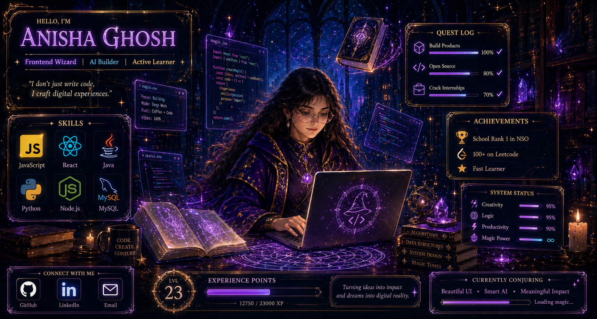

<p align="center">
  
</p>

<h1 align="center">✨ Anisha Ghosh ✨</h1>

<p align="center">
  
</p>

---

## 🧙‍♀️ About Me

```js
const anisha = {
  role: ["Frontend Wizard", "AI Builder", "Active Learner"],
  skills: ["JavaScript", "React", "Java", "Python", "Node.js", "MySQL"],
  currentQuest: ["Build Products", "Open Source", "Crack Internships"],
  mindset: "Code. Create. Conjure."
};## Hi there 👋

<!--
**Anisha-0505007/Anisha-0505007** is a ✨ _special_ ✨ repository because its `README.md` (this file) appears on your GitHub profile.

Here are some ideas to get you started:

- 🔭 I’m currently working on ...
- 🌱 I’m currently learning ...
- 👯 I’m looking to collaborate on ...
- 🤔 I’m looking for help with ...
- 💬 Ask me about ...
- 📫 How to reach me: ...
- 😄 Pronouns: ...
- ⚡ Fun fact: ...
-->
