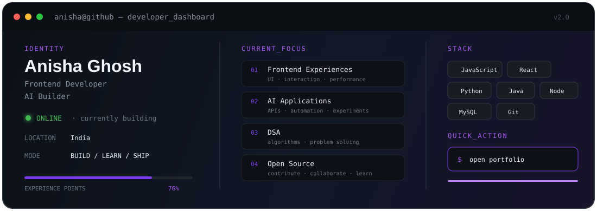

# ANISHA GHOSH

### Frontend Developer · AI Builder · Problem Solver

 

  

---

---

## 01 / ABOUT

I build things for the web.

My main interests are **frontend development, AI-powered applications, and problem solving**.

I enjoy taking an idea from:

<strong>concept → interface → implementation → product</strong>

Currently focused on becoming a stronger engineer through projects, DSA, experimentation, and open source.

<strong>What I care about</strong>

 

<table>
<tr>
<td>01</td>
<td>Clean interfaces</td>
</tr>
<tr>
<td>02</td>
<td>Good user experience</td>
</tr>
<tr>
<td>03</td>
<td>Practical AI applications</td>
</tr>
<tr>
<td>04</td>
<td>Understanding how things work</td>
</tr>
<tr>
<td>05</td>
<td>Writing code that is actually useful</td>
</tr>
</table>

---

## 02 / STACK

  

<code>JavaScript</code>
&nbsp;
<code>React</code>
&nbsp;
<code>HTML</code>
&nbsp;
<code>CSS</code>
&nbsp;
<code>Java</code>
&nbsp;
<code>Python</code>
&nbsp;
<code>Node.js</code>
&nbsp;
<code>MySQL</code>
&nbsp;
<code>Git</code>

---

## 03 / CONTRIBUTION GAME

### PAC-MAN // CONTRIBUTION MODE

 

<picture>
<source media="(prefers-color-scheme: dark)" srcset="https://raw.githubusercontent.com/Anisha-0505007/Anisha-0505007/output/pacman-contribution-graph-dark.svg">
<source media="(prefers-color-scheme: light)" srcset="https://raw.githubusercontent.com/Anisha-0505007/Anisha-0505007/output/pacman-contribution-graph.svg">

</picture>

 

PAC-MAN EATS MY CONTRIBUTIONS

---

## 04 / CURRENTLY BUILDING

<table>
<tr>

<td width="50%" valign="top">

<h3>FRONTEND</h3>

Building interfaces with a focus on:

<ul>
<li>Responsive layouts</li>
<li>Interaction</li>
<li>Component architecture</li>
<li>Visual polish</li>
</ul>

</td>

<td width="50%" valign="top">

<h3>AI</h3>

Exploring:

<ul>
<li>AI-powered products</li>
<li>APIs</li>
<li>Automation</li>
<li>Practical AI integrations</li>
</ul>

</td>

</tr>

<tr>

<td width="50%" valign="top">

<h3>DSA</h3>

Currently working on:

<ul>
<li>Problem solving</li>
<li>Algorithms</li>
<li>Data structures</li>
<li>LeetCode</li>
</ul>

</td>

<td width="50%" valign="top">

<h3>OPEN SOURCE</h3>

Learning through:

<ul>
<li>Real codebases</li>
<li>Collaboration</li>
<li>Documentation</li>
<li>Contributing</li>
</ul>

</td>

</tr>
</table>

---

## 05 / PROJECTS

<strong>EXAMIFY</strong> — Practice papers to exam environment

 

A web application that transforms practice papers into a realistic examination experience.

  

<strong>Tech:</strong> JavaScript · OCR · Frontend

 

<strong>QUERYFORGE</strong> — Data and backend project

 

A project exploring data workflows and backend-oriented development.

  

<strong>Tech:</strong> Python · Data

 

<strong>TRANSCRIBLY</strong> — Speech to text

 

A browser-based speech-to-text application using web APIs.

  

<strong>Tech:</strong> JavaScript · Web APIs

 

<strong>PORTFOLIO</strong> — Personal website

 

My personal portfolio showcasing projects, skills, experiments, and what I'm currently building.

  

<a href="https://anisha-ghosh.in/">Visit anisha-ghosh.in</a>

  

<strong>Tech:</strong> HTML · CSS · JavaScript

---

## 06 / ACHIEVEMENTS

<table>
<tr>
<th>Achievement</th>
<th>Result</th>
</tr>
<tr>
<td>National Science Olympiad</td>
<td><strong>School Rank 1</strong></td>
</tr>
<tr>
<td>LeetCode</td>
<td><strong>100+ Problems</strong></td>
</tr>
<tr>
<td>Current Focus</td>
<td><strong>Frontend + AI + DSA</strong></td>
</tr>
</table>

---

## 07 / GITHUB ANALYTICS

&nbsp;&nbsp;

  

---

## 08 / FIND ME

---

<strong>BUILD · LEARN · SHIP</strong>

  

<a href="https://anisha-ghosh.in/">
Visit my portfolio →
</a>

